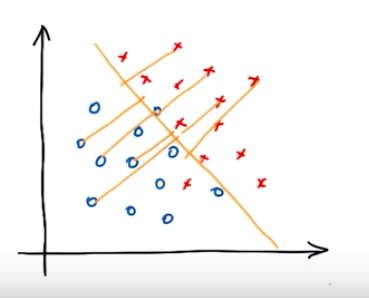
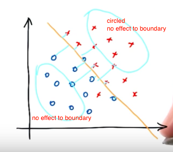
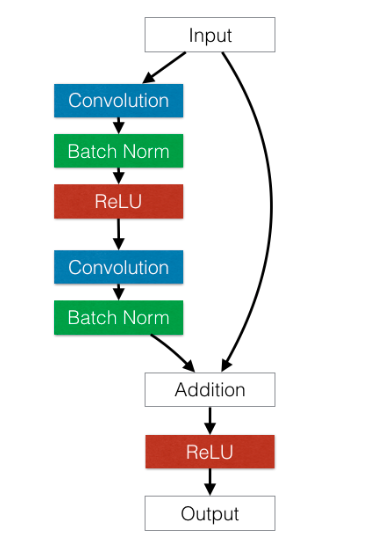
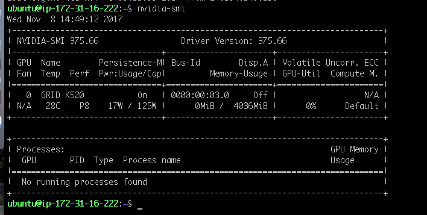

TODO:

why svm need dimension reduction, but nn not?


# ENEE633 Projet 1: Fashion-MNIST classifcation
**by Xuyi Ruan 11/18/2017**
## 1. Introduction

MNIST handwritten dataset is one of the classical data set to benchmark classification model in machine learning. As GPUs became more accessible, many of the neural network models could easily achieved $99.0\%$ or above accuracy on MNIST handwritten number dataset. Because of this, the MNIST fashion dataset emerged.  

Fashion-MNIST, a MNIST like dataset, has the same format (training set of 60,000 examples and a test set of 10,000 examples, input size $28\times28$, and $10$ output classes) as MNIST handwritten dataset but slightly more complicated image contents. The intension of this dataset is to make more distinguish performance for different types of classifers. We will explore SVM and various neural network models and compare their performance on Fashion-MNIST dataset in this report. 

## 2. SVM Classifer & LDA

### Experiment results

| Classifier Type   | Test Accur.  | Train time | Config.  |
| :------------- |:-------------:| -------------:| :-----|
| SVM Linear (NO PCA)   | 84.74% | 28.83 mins | $c=1, \gamma=0.025$ |
| SVM Linear | 85.37%    |   9.94 mins | $c=10, \gamma=0.025, pca=140$ |
| SVM Poly (NO PCA) | 66.81%    |   152.89 mins | $c=1, \gamma=0.025$ |
| SVM Poly | 87.49%   |   3.37 mins| $c=1, \gamma=0.025, pca=40$ |
| SVM Poly | 88.59%   |    2.26 mins | $c=10, \gamma=0.025, pca=40$ |
| SVM RBF (NO PCA) | 43.27%   |   407.95 mins |  $c=1, \gamma=0.025$ |
| **SVM RBF** | **88.77%**     |    **4.33 mins** | **$c=10, \gamma=0.025, pca=40$** |
| SVM RBF | 88.14%     |    7.52 mins | $c=1, \gamma=0.01, pca=40$ |

### Data-preprocessing

By default, MNIST-fashion data is image in grey-scale value $[0-255]$ for each pixel. We need to normalize the data into $[0-1]$ range otherwise objective functions will not work properly.  

In tensorflow, no manual pre-processing is required because data was inherently normalized by `read_data_sets()` function.

```python
// src: https://github.com/tensorflow/tensorflow/blob/4af9be964eff70b9f27f605e0f5b2cb04a5d03cc/tensorflow/contrib/learn/python/learn/datasets/mnist.py

input_data.read_data_sets("MNIST_data/fashion", one_hot=False)

read_data_sets(){
	...
	
    if dtype == dtypes.float32:
        # Convert from [0, 255] -> [0.0, 1.0].
        images = images.astype(numpy.float32)
        images = numpy.multiply(images, 1.0 / 255.0)
   ...
} 
```

### Principle Component Analysis(PCA)

Each sample in MNIST dataset has 768 dimensions ($28 \times 28$), which is considered a really high dimension. High dimensional data is usually hard to deal with since data become sparse as we go to high dimensional space. Sparsicity in data is not good for algorithm to learn all the feature in high dimension. Therefore, reduce dimensionality is performed with PCA to help alogorithm to better learn a good boundary for classification task. 

### a) SVM Linear Experiments
**SVM Linear wo/ PCA**  
Accuracy = 84.74% (8474/10000) (classification)  
Time to classify: 28.83 minuites.  

**SVM Linear w/ PCA = 140**  
Accuracy = 85.37% (8537/10000) (classification)  
Time to classify: 9.94 minuites.  

### b) SVM Polynomial Experiments

**SVM Polynomial cost=1**  
Accuracy = 66.81% (6681/10000) (classification)  
Time to classify: 152.89 minuites.  

**SVM Polynomial w/ PCA=40 cost=1**  
Accuracy = 87.49% (8749/10000) (classification)  
Time to classify: 3.37 minuites.  

**SVM Polynomial w/ PCA=40 cost=10**  
Accuracy = 88.59% (8859/10000) (classification)  
Time to classify: 2.26 minuites.  

### c) SVM RBF Experiments

**SVM RBF wo/ PCA**  
Accuracy = 43.27% (4327/10000) (classification)  
Time to classify: 407.95 minuites.  

**SVM RBF = -c 10 -t 2 -g 1/40' w/ PCA=40**  
Accuracy = 88.77% (8877/10000) (classification)  
Time to classify: 4.33 minuites.

**SVM RBF = -c 10 -t 2 -g 1/40 -e 0.1' w/ PCA=40**  
Accuracy = 88.69% (8869/10000) (classification)  
Time to classify: 4.04 minuites.  

**SVM RBF = -c 1 -t 2 -g 0.1' w/ PCA=40**  
Accuracy = 88.14% (8814/10000) (classification)  
Time to classify: 7.52 minuites.  

### SVM Summary:

- using PCA helps to reduce feature dimension, hence reduce computation time  
- using PCA helps to select most useful features, hence increase accuracy: since PCA find features with most variance(large variance good in this case, since that make it more easier to seperate different classes)  
- SVM with polynomial kernel is slightly better than SVM linear alone since polynomial kernel explores **non-linear** feature of data  
- Less principle components were required for polynomial kernel SVM since it already raised bouduary to higher dimension (higher dimension means more **non-linear feature**) for classification (so it need less principle components than linear one)  
- PCA with less principle components (40 vs 140) also reduce computation time in general(3 minutes vs 9.9 minutes)  
- SVM + RBF + PCA = 40 has the highest accuracy of 88.77% accuracy for MNIST fashion dataset at this experiment    

**Hyper-parameter C:**  
- **higher c**: less tolerant, more wavy boundary, more accuracy in training set, usually overfit in test set  
- **lower c**: more tolerant, more smooth boundary, less accuracy in training set, but less overfit to test set  
- usually, we would like to have a simple linear boundary to prevent overfitting  


**Hyper-parameter Gamma ($\gamma$):**  
- **smaller $\gamma$**: both close and far points affect shape of boundry (less weight with closer points) -> more linear straight boundary (lower bias, higer variance)  



- **larger $\gamma$**: only closer points affect shape of boundry -> wavy boundary (higer bias, lower variance)



## Linear Discriminant Analysis (LDA)

LDA is really stright forward to implment in sklearn. Implementation detail could be found at `MNIST_fash_lda.py`. There is not any parameter we could tune so I will simply record the result here: $81.5\%$ accuracy with train time of 0.14 mins. 

## 3. Neural Network Classifer

### Experiment results

| Classifier Type   | Test Accur.  | Train time | Config.  |
| :------------- |:-------------:| -------------:| -----:|
| LeNet/CNN	 | 91.54%     |    104.87 mins| detail below |
| ResNet Like | 93.81%     |     2:50:26s | detail below |
| VGG Like | 91.67%*     |    1:22:23s* | detail below |

> * VGG spot instance reclaimed by amazon and did not finish all training (epoach [18/100]). Picked best test accuracy on among 18 epochs.

### Background Information

**One hot output**  
- output of softmax is the probablity (0-1) of decision class  
- (ex. 4-class output example: `C1: 0.85, C2, 0.05, C3: 0.05, C4: 0.05`)  
- so having a numerical label (1,2,3, etc) does not work  
- ensure output in one-hot (0, 1, 0, 0) format also allows easier calculation on back-prop  

**Dropout Technique**

Dropout technique is used to prevent neural network model from **overfitting** (good accuracy at training, but not well in test data set) the training data. Dropout technique randomly select node **NOT** to update those weights in that cycle, so that overall trained network is **more robust** (less overfit to train data). 

**Softmax classifier**  
softamx function "squashes" a K-dimensional vector into real values in the range of $[0, 1]$, which all of them add up to 1.   

### LeNet/Convolutional Neural Network (CNN)

I used a standard LeNet like CNN structure with two **convolutional** layers follow by two $2 \times 2$ **max pooling** layers together with two **fully connected** with single **dropout layer**, detailed below:  

```
_________________________________________________________________
Layer (type)                 Output Shape              
=================================================================
input                        (None, 28, 28, 1) 
_________________________________________________________________
conv2d_1 (Conv2D) + ReLu     (None, 28, 28, 32)          
_________________________________________________________________
max_pooling2d_1              (None, 14, 14, 32)              
_________________________________________________________________
conv2d_2 (Conv2D) + ReLU     (None, 14, 14, 64)             
_________________________________________________________________
max_pooling2d_2              (None, 7, 7, 64)                  
_________________________________________________________________
FC1                          (None, 1024)                  
_________________________________________________________________
dropout_1 (Dropout)          (None, 1024)                       
_________________________________________________________________
FC2                          (None, 10)                  
_________________________________________________________________
Output                       (None, 10)
_________________________________________________________________
```

#### Parameters:  
- training set 60k (validation set combined), test set 10k.
- iteration: 20000
- batch size: 50
- dropout rate during training: 0.5

#### Result
```
Time to train: 61.87 minuites.  
Test accuracy 0.9154
```

### VGG Like

Original VGG net was designed to work with input size $244 \times 244 \times 3$ image, we need to adjust VGG net accordingly to work with MNIST_fashion dataset(input size of $28 \times 28 \times 1$)  

#### Layout
```
# x: [28, 28, 1]
# CONV3-64: [14, 14, 64]
# CONV3-64: [14, 14, 64]
# POOL2: [7, 7, 64]
# CONV3-128: [14, 14, 128]
# CONV3-128: [14, 14, 128]
# POOL2: [7, 7, 128]
# CONV3-256: [4, 4, 256]
# CONV3-256: [4, 4, 256]
# POOL1x1: [4, 4, 256]
# 4096 -> 10
# softmax
```

#### Parameters:  

```
AUGMENTATION_TYPE=affine
BATCH_SIZE=128
GPU_MEMORY_FRACTION=1.0
GPU_NUM=0
IGNORE_EXIST_MODEL=False
LEARNING_RATE=0.001
MODEL_NAME=vggnet
NUM_EPOCHS=100
RESNET_LAYER_N=3
SAVE_DIR=tmp
```
#### Result

```
========== training start ==========
[1/100] train: 0.7616, 72.585% / valid: 0.7616, 72.06% / test: 0.7902, 71.50% [0:04:38]
[2/100] train: 0.8033, 80.380% / valid: 0.7822, 81.14% / test: 0.8191, 80.05% [0:09:13]
[3/100] train: 0.4268, 84.564% / valid: 0.4234, 85.22% / test: 0.4421, 84.21% [0:13:49]
...
[16/100] train: 0.1954, 92.782% / valid: 0.2091, 92.38% / test: 0.2266, 91.67% [1:13:24]
[17/100] train: 0.2147, 91.902% / valid: 0.2253, 91.66% / test: 0.2454, 90.68% [1:18:00]
[18/100] train: 0.1991, 92.547% / valid: 0.2083, 92.04% / test: 0.2335, 91.11% [1:22:34]
```
> * VGG spot instance reclaimed by amazon and did not finish all training (epoach [18/100]). Picked best test accuracy on among 18 epochs.


### ResNet Like

As we already discovered, deeper network (more layers) tends to have better detection accuracy. Therefore, we should build nn-net which with more layers. However, when network became too deep, it has folloowing two problems:   

1. vanishing gradients and   
2. training error significantly increase when network became too deep. 

Vanishing graident could be resolved with replacing signmoid with ReLu. Second problem was resolved with **residual learning** in ResNet.   


Similiar to VGG, we also need to adjust ResNet network accordingly to work with MNIST_fashion dataset (input size of $28 \times 28 \times 1$)  

#### Layout


```
# x: [28, 28, 1]
# conv0: conv-bn-relu [-1, 28, 28, 16]
# conv1: [-1, 28, 28, 16] * n
# conv2: [-1, 14, 14, 32] * n
# conv3: [-1,  7,  7, 64] * n
# Avg-Pool
# Softmax
```

#### Result

```
[100/100] train: 0.0966, 96.322% / valid: 0.2411, 92.76% / test: 0.2476, 92.54% [2:50:26]
[train max] [98/100] train: 0.0675, 97.513% / valid: 0.1850, 94.12% / test: 0.2005, 93.51%
[valid max] [77/100] train: 0.0812, 97.015% / valid: 0.1757, 94.26% / test: 0.1962, 93.45%
[  final  ] [100/100] train: 0.0966, 96.322% / valid: 0.2411, 94.81% / test: 0.2476, 93.81%
```


### Neural Network Summary:
Wtih access to ec2 GPU instance, I was able to conduct some experiments with GPU and the computation time was significantly reduced compare to initial attempt experiments with CPU alone. The overall test accuracy was higher (all three test Neural Nets achieved above 90% test accuracy) comparing to SVM classifiers. **ResNet** like neural network achived the best test accuracy of 93.81% on MNIST fashion dataset at this experiment.

## 4. Conlcusion

With stronger computational power avaliable, neural network learning models tend to have a higher overall accuracy compare to SVM models in this experiment. Specifically, **ResNet** like neural network won the competation in MNIST Fashion dataset with 93.81% test accuracy. Even **VGG** like model, unfortunatly, was not able to complete the entire training epochs, the final test accuracy will be expected to be slightly lower than **ResNet** like model since ResNet has much deeper model than **VGG** like net.  

As we can see from the comparison chart below, the computation time needed for training in neural network models (~ hours) was much higher than than the time required for SVM models (< 10mins), which should be take into account when design real time application if the model is required to be updated regularly. 

| Classifier Type   | Test Accur.  | Train time | Config.  |
| :------------- |:-------------:| -------------:| -----:|
| LDA | 81.50% | 0.16 mins | NA |
| SVM Linear w/PCA   | 85.37% | 9.94 mins | $c=1, \gamma=0.025$ |
| SVM Poly w/PCA | 88.59%      |   2.26 mins | $c=10, \gamma=0.025$ |
| SVM RBF w/ PCA | 88.77%      |   4.33 mins | $c=10, \gamma=0.025$ |
| LeNet/CNN	 | 91.54%     |    104.87 mins | detail above |
| **ResNet** | **93.81%**     |     2:50:26s | detail above |
| VGG | 91.67%*     |    1:22:23s* | detail above |

> SVM, CNN, LeNet ran on AWS EC2 CPU instance `t2.medium` 2CPUs + 4.0GB RAM  
> ResNet and VGG ran on AWS EC2 GPU spot instance with NVIDIA GRID K520 4GB RAM + 8CPUs + 16GB RAM 



> * VGG spot instance reclaimed by amazon and did not finish all training (epoach [18/100]). Picked best test accuracy on among 18 epochs.


<br><br><br><br><br><br><br><br><br><br><br><br>


## 5. References

### SVM
Dimension reduction [great post!] 
http://www.cnblogs.com/kym/archive/2012/12/21/2827791.html
- Cosine similarity: https://en.wikipedia.org/wiki/Cosine_similarity  

silklearn dimen reduction: 
https://stackoverflow.com/questions/32194967/how-to-do-pca-and-svm-for-classification-in-python

PCA on on MNIST example:
http://vzaguskin.github.io/mnistpcaknn1/

understand SVM parameter meanings in one video
https://classroom.udacity.com/courses/ud120/lessons/2252188570/concepts/23972185420923

What are C and gamma with regards to a support vector machine?
https://www.quora.com/What-are-C-and-gamma-with-regards-to-a-support-vector-machine

### NN

[VGG and Resnet Like](https://github.com/khanrc/mnist)  
[CNN发展史](http://www.cnblogs.com/52machinelearning/p/5821591.html)  
http://cs.stanford.edu/people/karpathy/convnetjs/demo/cifar10.html
ResNet 6大变体对
http://blog.csdn.net/zchang81/article/details/75948391
VGG in TensorFlow
https://www.cs.toronto.edu/~frossard/post/vgg16/
ImageNet: VGGNet, ResNet, Inception, and Xception with Keras
https://www.pyimagesearch.com/2017/03/20/imagenet-vggnet-resnet-inception-xception-keras/
Joint Density Functions
https://www.colorado.edu/economics/morey/6818/jointdensity.pdf

[residual learning](http://blog.csdn.net/App_12062011/article/details/62221296)

### Tensorflow
https://www.tensorflow.org/get_started/mnist/beginners
https://github.com/zalandoresearch/fashion-mnist

MNIST-classification-example-3: 
https://github.com/yuzhounh/MNIST-classification-example-3/blob/master/classify_MNIST.py

Get image from MNIST data set:
http://www.csuldw.com/2016/02/25/2016-02-25-machine-learning-MNIST-dataset/

`read_data_from ()` etc fuction
https://github.com/tensorflow/tensorflow/blob/master/tensorflow/contrib/learn/python/learn/datasets/mnist.py

[[GOOD] great tutorial with visualization on layers](https://github.com/sjchoi86/Tensorflow-101)

[How far can we go with MNIST??](https://github.com/hwalsuklee/how-far-can-we-go-with-MNIST)

One hot  
[One hot encoding](http://www.cs.toronto.edu/~guerzhoy/321/lec/W04/onehot.pdf)  
[Andrew NG, Softmax Regression](https://www.youtube.com/watch?v=LLux1SW--oM)
