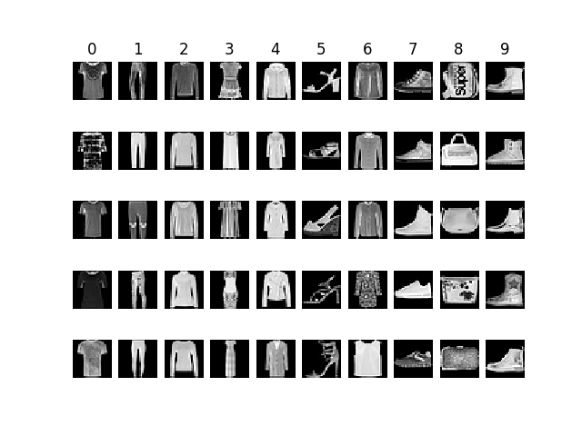
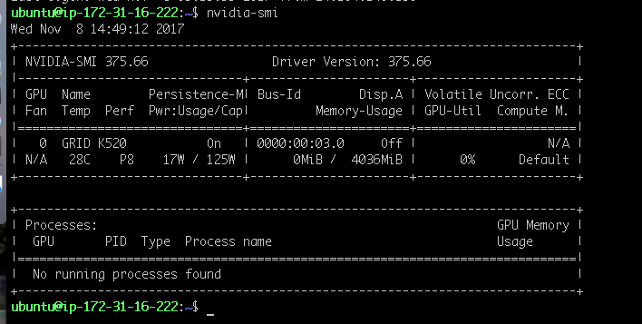

# ENEE633 Projet 2: Fashion-MNIST classifcation
**by Xuyi Ruan 12/11/2017**



## 1. Introduction

MNIST handwritten dataset is one of the classical data set to benchmark classification model in machine learning. As GPUs became more accessible, many of the neural network models could easily achieved $99.0\%$ or above accuracy on MNIST handwritten number dataset. Because of this, the MNIST fashion dataset emerged.  

Fashion-MNIST, a MNIST like dataset, has the same format (training set of 60,000 examples and a test set of 10,000 examples, input size $28\times28$, and $10$ output classes) as MNIST handwritten dataset but slightly more complicated image contents. The intension of this dataset is to make more distinguish performance for different types of classifers. We will explore SVM and various neural network models and compare their performance on Fashion-MNIST dataset in this report. 

### Principle Component Analysis (PCA)

Each sample in MNIST dataset has 768 dimensions ($28 \times 28$), which is considered a really high dimension. High dimensional data is usually hard to deal with since data become sparse as we go to high dimensional space. Sparsicity in data is not good for algorithm to learn all the feature in high dimension. Therefore, reduce dimensionality is performed with PCA to help alogorithm to better learn a good boundary for classification task. 


## 2. Gaussian Naive Bayes + MLE

### Dimension Reduction with PCA
For GaussianNB + PCA, I performed cross-validation on following parameter:   
- $PCA_{component}$ number of principle component.   

Cross-validation on $PCA_{component}$ achieves the best classifcation accuracy at $ 76.68\%$ with chioice of $pca=50$ 

### Dimension Reduction with LDA

$\texttt{LDA}$ dimension reduction is performed by $\texttt{LinearDiscriminantAnalysis()}$ library provided in $\texttt{sklearn}$. Dimension reduction with $\texttt{LDA}$ achieves classifcation accuracy at $ 81.09\%$.

### Experiment Results

| Classifier Type   | Test Accur.  | Train time | Config.  |
| :------------- |:-------------:| -------------:| :-----|
| GaussianNB   | 76.62% | 2.87 seconds | NA |
| GaussianNB + PCA | 76.68%    |   0.28 seconds | $pca=50$ |
| **GaussianNB + LDA** | **81.09%**    |   **0.07 seconds** | $NA$ |

By using dimension reduction, we can see decent classification accuracy improvement for LDA. However, using PCA in bayes classifier does not improve much. The reasoning behind is with PCA dimension reduction, the projected new features still remain gaussian distributed as before, hence no significant changes in classification accuracy. On the other hand, LDA produces better accuracy improvement beacuse of the its supervised leraning natural with the additional label information to help better perform classification task.


## 3. K-Nearest Neighbor (kNN) Rule
-  with chosen $k$, kNN is an non-parametric technique  

### Dimension Reduction with PCA

I utilized the $\texttt{PCA()}$ library provided in $\texttt{sklearn}$ to perform PCA dimension reduction.

```python
	pca = PCA(n_components=PCA_component)
	pca.fit(train_data)

	image_train_pca = pca.transform(train_data)
	image_test_pca = pca.transform(test_data)
```

For Nearest Neighbor + PCA, I performed cross-validation on following parameters:   
- $PCA_{component}$ number of PC and   
- $K$ number of neighbor  
and the result show best classifcation accuracy at $86.64\%$ with $pca = 110$ and $k=10$. The computation time also increases propostional to the size of choosen $pca$. Even the size of $k$ stay constant, number of feature  participate in the disctance calcuation between two sample points increase as $pca$ increase.  


### Dimension Reduction with LDA

Similiarly to $\texttt{PCA}$, I utilized the $\texttt{LinearDiscriminantAnalysis()}$ library provided in $\texttt{sklearn}$ to perform LDA dimension reduction.

```python 
	lda = LinearDiscriminantAnalysis()
	lda.fit(train_data, train_label)

	image_train_pca = lda.transform(train_data)
	image_test_pca = lda.transform(test_data)
```

Noted in $\texttt{LDA()}$, default `n_components` = size of class - 1. Also, it is important to note $\texttt{LDA()}$ is an **supervised** technique so we need `train_label` in this case. (while $\texttt{PCA()}$ is a **unsupervised** technique).


### Experiment Results


| Classifier Type   | Test Accur.  | Train time | Config.  |
| :------------- |:-------------:| -------------:| :-----|
| kNN | 85.38%    |   399.38 seconds | $k = 10$ |
|**kNN + PCA** | **86.64%**   |   **13.42 seconds** | $pca=110, k = 10$ |
| kNN + LDA | 83.10%    |   0.80 seconds | $NA$ |

From the result, we can clearly see dimension reduction is very essential steps in classfication task.  
1. it significantly **reduces** computation time (distance calculation in kNN case).  
2. it also **improve** classifcation **accuracy**, because it **select** the most **useful features** out of all present features. 

Between LDA and PCA, PCA results in better classifcation accuracy. The reasoning behind might be PCA choose more useful features (`n_component=110`) compare to LDA (`n_component=10`) from all avaiables features ($28\times28 = 768$).  

kNN without any dimension reduction perform slightly better than kNN + LDA. However, the computation complexity for kNN without dimension reduction is too high to justify the **minor** improvment in accuracy.

## 4. Comparison to SVM and deep learning

| Classifier Type   | Test Accur.  | Train time | Config.  |
| :------------- |:-------------:| -------------:| -----:|
| **GaussianNB + LDA** | 81.09%    |   **0.07 seconds** | $NA$ |
|kNN + PCA | 86.64%   |   13.42 seconds | $pca=110, k = 10$ |
| LDA | 81.50% | 0.16 mins | NA |
| SVM Linear w/PCA   | 85.37% | 9.94 mins | $c=1, \gamma=0.025$ |
| SVM Poly w/PCA | 88.59%      |   2.26 mins | $c=10, \gamma=0.025$ |
| SVM RBF w/ PCA | 88.77%      |   4.33 mins | $c=10, \gamma=0.025$ |
| LeNet/CNN	 | 91.54%     |    104.87 mins | detail above |
| **ResNet** | **93.81%**     |     2:50:26s | detail above |
| VGG | 91.67%*     |    1:22:23s* | detail above |

Table above shows comparison of all classification technique used in MNIST_fash classification task.

With stronger computational power avaliable, neural network learning models tend to have a higher overall accuracy compare to SVM models, GussianNB, and kNN in this experiment. Specifically, **ResNet** like neural network won the competation in MNIST Fashion dataset with 93.81% test accuracy. Even **VGG** like model, unfortunatly, was not able to complete the entire training epochs, the final test accuracy will be expected to be slightly lower than **ResNet** like model since ResNet has much deeper model than **VGG** like net.  

For computational complexity, GaussianNB can be **extremely fast** compared to other classifiers. As we can see from the comparison chart below, the computation time needed for training in neural network models (~ hours) was much higher than than the time required for SVM models (< 10mins) and for kNN/GaussianNB (~seconds), which should be take into account when design real time application if the model is required to be updated regularly. 

> SVM, CNN, LeNet, GaussianNB, kNN ran on AWS EC2 CPU instance `t2.medium` 2CPUs + 4.0GB RAM  
> ResNet and VGG ran on AWS EC2 GPU spot instance with NVIDIA GRID K520 4GB RAM + 8CPUs + 16GB RAM 



> * VGG spot instance reclaimed by amazon and did not finish all training (epoach [18/100]). Picked best test accuracy on among 18 epochs.

## 5. References
[1] [sklearn.LinearDiscriminantAnalysis](http://scikit-learn.org/stable/modules/generated/sklearn.discriminant_analysis.LinearDiscriminantAnalysis.html#sklearn.discriminant_analysis.LinearDiscriminantAnalysis.fit)  
[2] [sklearn.PCA](http://scikit-learn.org/stable/modules/generated/sklearn.decomposition.PCA.html)  
[3] [sklearn.GaussianNB](http://scikit-learn.org/stable/modules/naive_bayes.html#gaussian-naive-bayes)  
[4] [How to Get 97% on MNIST with KNN](https://steven.codes/blog/ml/how-to-get-97-percent-on-MNIST-with-KNN/)  
[5] [fit() and transform() methods](https://stackoverflow.com/questions/23838056/what-is-the-difference-between-transform-and-fit-transform-in-sklearn)  
[6] [PCA returned negative values](https://stackoverflow.com/questions/34725726/is-it-possible-apply-pca-on-any-text-classification)  
[7] [tutorial on Bayes basic](https://lazyprogrammer.me/bayes-classifier-and-naive-bayes-tutorial-using/)  
[8] [Naive Bayes on MNIST dataset](https://github.com/bikz05/ipython-notebooks/blob/master/machine-learning/naive-bayes-mnist-sklearn.ipynb)  
[9] [MNIST HW u-brown](http://cs.brown.edu/courses/csci1950-f/fall2009/docs/wk04.pdf)